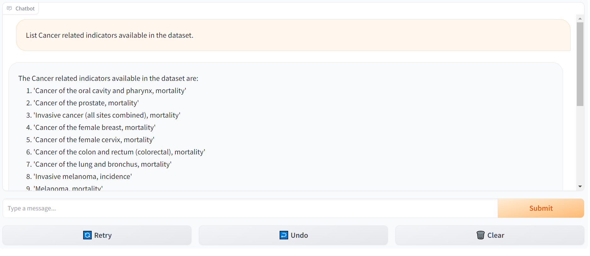
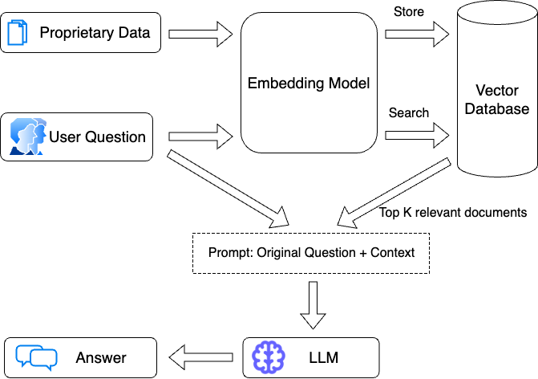

# Welcome to the Chat With U.S. Chronic Disease Data Project! 🚀

## Introduction
Welcome to the repository! 🤖 In this GitHub, we embark on a journey to create chatbots powered by Large Language Models, specifically the GPT-4 model, using the Gradio library interface. The main goal of this project is to engage in what we term "Chat With Data." The innovation of GPTs has helped businesses think outside the box in developing chatbots based on their own data, powered by LLMs. This approach is undoubtedly superior to creating a basic NLP solution. The evolution of LLMs has significantly contributed to the fields of Data Science, Machine Learning, and Software Development. Industries should start leveraging such models to empower their domains. Our dataset, sourced from CDC's Division of Population Health, provides a comprehensive set of 124 indicators, enabling uniform definition, collection, and reporting of chronic disease data. Feel free to use any data you prefer for chatting, experiment with parameters and functions to achieve the optimal solution, and enjoy conversing with your data.

### Dataset Overview
The dataset is structured with 124 indicators in the column ["Questions"], classified under 17 health topics. Each question is answered across various Stratification categories and data value types. The dataset, in long format, covers state and national levels from 2008 to 2020, with some values presented as averages over a range of years, as indicated in the YearStart and YearEnd columns.

Data Source: https://catalog.data.gov/dataset/u-s-chronic-disease-indicators-cdi

## Directory Structure:

1. **`data`:**
   - Preprocessed data stored in `results.csv` reflecting different approaches.
   - Evaluate results using the provided evaluation questions in the notebooks.

2. **`Notebooks`:**
   - [`getProcessData`](./Notebooks/getProcessData.ipynb): Preprocess data and save it in the 'data' directory.
   - Additional notebooks for different approaches:
     - [LangChain](./Notebooks/LangChain.ipynb)
     - [LlamaIndex](./Notebooks/LlamaIndex.ipynb)
     - [Visualizations](./Notebooks/Visualizations.ipynb)
   - **Instructions:**
      - Run [`getProcessData`](./Notebooks/getProcessData.ipynb).
      - Update `.env` with OpenAI, Pinecone, Hugging Face, and Database IDs.
      - Install dependencies with `pip install -r /../requirements.txt`.

3. **`Scripts`:**
   - Files for the Llama index approach.

4. **`Images`:**
   - Sample chatbot outputs and RAG explanations.

5. **`Requirements.txt`:**
   - Essential Python packages and dependencies.

## Usage Guide:

1. Execute [`getProcessData`](./Notebooks/getProcessData.ipynb) to preprocess data in 'data'.

2. Update `.env` with required IDs (OpenAI, Pinecone, Hugging Face, Database).

3. Install dependencies: `pip install -r /../requirements.txt`.

4. Explore different Chat With Data approaches in the notebooks.

## Getting Started

### 1. Download the GitHub Code
Clone or download the GitHub code to your local machine. 📥

### 2. Install Packages & Dependencies
Use the following code in your command prompt to install the dependencies listed in the requirements.txt file and ensure smooth execution of your notebook:
```pip install -r /path/to/requirements.txt```

### 3. Data Loading & Preprocessing
Open the "Data Loading & Preprocessing" notebook and run the provided notebook. This step ensures that the dataset is loaded correctly.

### 4. Explore Different Approaches
Explore different approaches in the provided notebooks. In the notebook, add your OpenAI/AzureOpenAI API credentials as needed. 🧠

#### - PandasAgentLangChainChatbot
This notebook demonstrates how to use agents to interact with a Pandas DataFrame, optimized for question answering. The PandasAgent reads the dataframe, executes Python code, and provides answers in a chat format using the Gradio Chatbot Interface.

You can check its documentation here: https://python.langchain.com/docs/integrations/toolkits/pandas

###### Chatbot Sample:



#### - Retrieval Augmented Generation (RAG) using LangChain
Explore challenges with RAG and its optimal use with text data rather than a simple dataframe. Interact with the Chronic disease data using the RAG-LangChain file and Gradio interface.

Here is how RAG works (source: https://blog.langchain.dev/espilla-x-langchain-retrieval-augmented-generation-rag-in-llm-powered-question-answering-pipelines/)


You can check its documentation here: https://python.langchain.com/docs/use_cases/question_answering/

#### - LlamaIndex Approach
Discover an alternative approach using GPT-4, initializing the LlamaIndex agent, and prompting the GPT for answers. Similar to PandasAgent, it involves coding and returns answers.

### 5. Evaluation
Compare various approaches by referencing the evaluation questions provided in the evaluation notebook. Assess the performance of each method based on the answers obtained. We encourage you to experiment more advanced evaluation methods discussed in this medium: https://medium.com/discovery-at-nesta/how-to-evaluate-large-language-model-chatbots-experimenting-with-streamlit-and-prodigy-c82db9f7f8d9

## Conclusion
This repository introduces novel approaches, highlighting the capabilities of Large Language Models (GPT-4) for dynamic interactions with data. It presents opportunities for future enhancements, including fine-tuning function parameters, crafting custom agents, refining evaluation methods, and optimizing dataset preprocessing. We strongly encourage collaboration and continuous improvement by welcoming contributions and feedback from you. Your active engagement will contribute to the ongoing evolution and success of this project.

## About Section:
#### Masters of Applied Data Science Program Capstone Project - University of Michigan
#### Team 1 - Team Mediterranean
1. Anze Zorin (azorin@umich.edu)
2. Eugene Yiga (yiga@umich.edu)
3. Mohamed Abdelrahman (mohameyo@umich.edu)
   
Feel free to reach out to any of our team members via the provided email addresses. Enjoy exploring the possibilities and happy coding! 🎉
